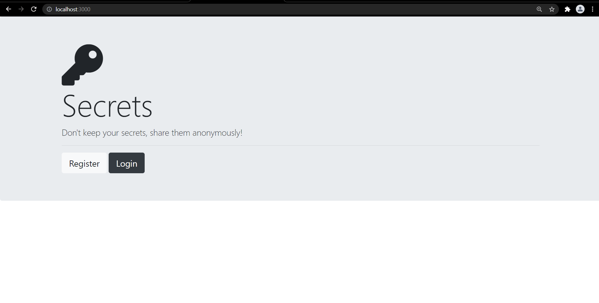
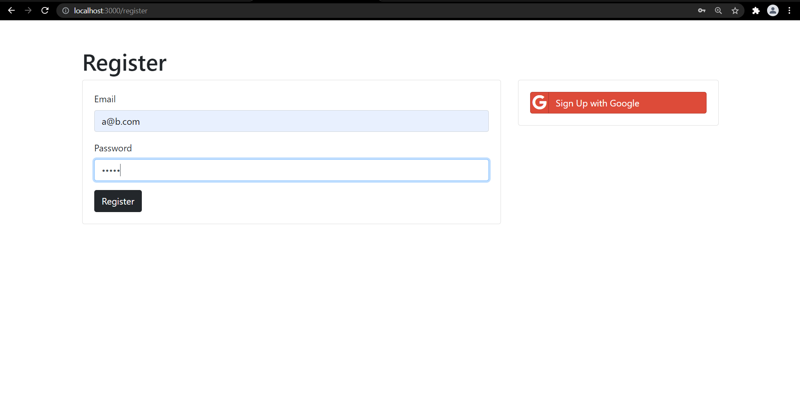
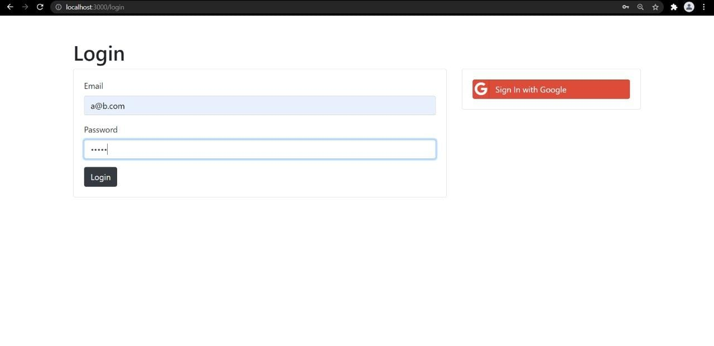
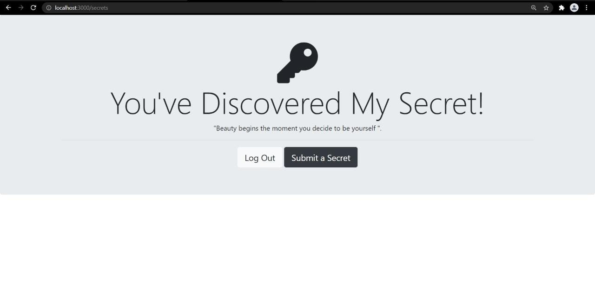
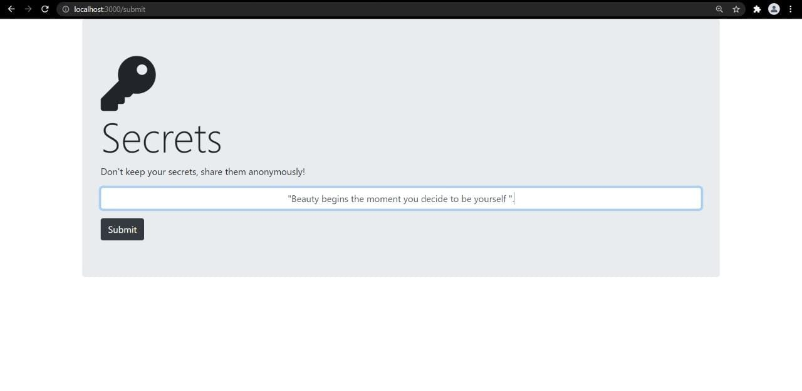

# Secret-web-page
<h5>This is a full stack we application. In which user can create, update, read their secrets with the functionality of google account login or standard login.</h5>

<h2>Installation</h2>
<h5> To install, simply clone this repository & run the following command npm install, this will install all the dependencies for you. </h5>

<h2>Running Project</h2>
<h5>To run this project locally, run the following command npm start, this will start a local instance of the application & you will be able to run the app in your browser at this url <a href="url">http://localhost:3000/ </a> </h5>

<h2>Welcome page</h2>
<h5>Here user can register and longin, longin details wiil be stored in Mongodb Database</h5>

<h2>Register page</h2>
<h5>Here user can register, user details wiil be stored in Mongodb Database</h5>

<h2>login page</h2>
<h5>Here user can register, user details wiil be stored in Mongodb Database</h5>

<h2>Secrets page</h2>
<h5>Here user can save their secrets.</h5>

<h2>Submit page</h2>
<h5>Here user submit their secrets, and all the user secrets are safe, nobody can read them.</h5>

